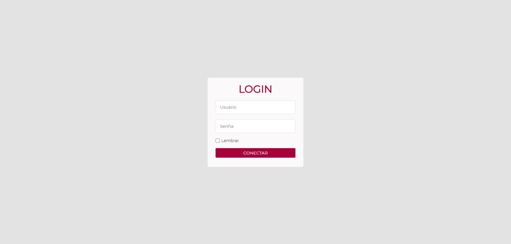
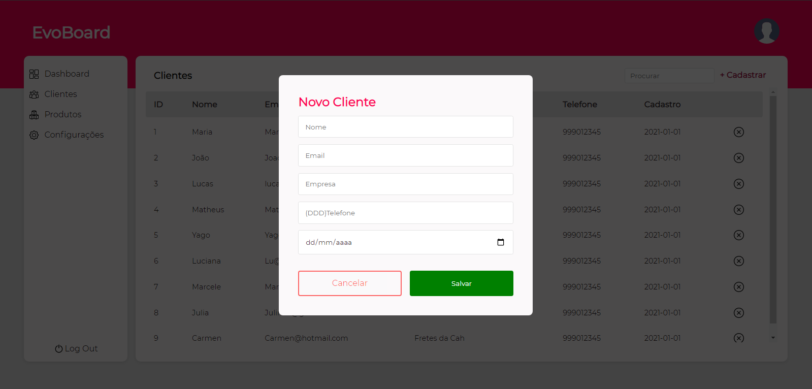
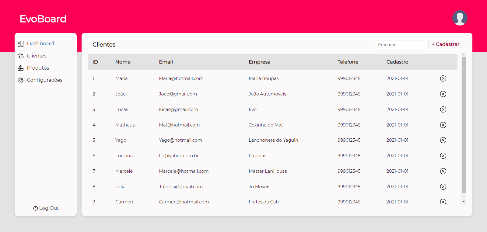

<h1 align="center"> EvoBoard </h1>

[DashBoard](https://dashboardclient.netlify.app/)

<h4 align="center">
Usuário: admin
Senha: 123
</h4>

 

<h1 align="center">
  
  
  
</h1>

 

## 🚀 Tecnologias

Esse projeto foi desenvolvido com as seguintes tecnologias:

- HTML
- SASS
- JavaScript

## 💻 Projeto

Foi realizado apenas a parte de cadastro de clientes no EvoBoard para estudos de javascript.
O projeto contará com melhorias e novas funcionalidades conforme avanços nos estudos.
